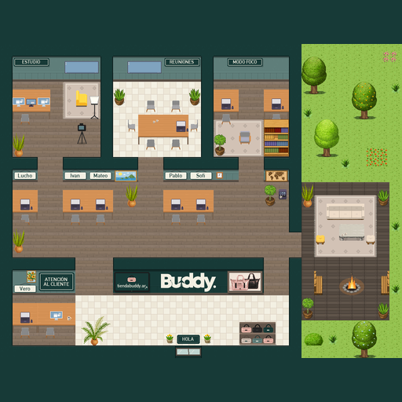

# Oficina Buddy

Oficina virtual del equipo Buddy para [WorkAdventure](https://workadventu.re), armada sobre el
[map-starter-kit](https://github.com/workadventure/map-starter-kit) oficial.

- **Cómo verla, publicarla y cambiarla:** [INSTRUCCIONES.md](./INSTRUCCIONES.md)
- **Mapa:** `oficina.tmj`, generado por `herramientas/construir.py` (nombres y pantallas se configuran ahí)
- **Tilesets propios:** `tilesets/buddy_*.png` (generados). Los `tilesets/WA_*.png` son del starter kit
  (CC-BY-SA 3.0, WorkAdventure).
- **Imágenes originales:** `originales/` (logo y foto de los bolsos)

## Comandos

| Comando | Qué hace |
|---|---|
| `npm install` | Instala lo necesario (una sola vez) |
| `npm run dev` | Levanta el mapa en `http://localhost:5173` para probarlo |
| `npm run buildmap` | Arma y valida el mapa como en la publicación |
| `python3 herramientas/construir.py` | Regenera mapa, carteles y vista previa |

## Licencias

- Código: [LICENSE.code](./LICENSE.code)
- Tilesets del starter kit: [LICENSE.assets](./LICENSE.assets)
- Base del mapa: [LICENSE.map](./LICENSE.map)
